# Convex Hull Visualizer

Step-by-step geometric Convex Hull visualizer yang mendukung tiga algoritma, yaitu **Graham Scan**, **Jarvis March**, dan **QuickHull**, lengkap dengan animasi proses, berbagai metode input titik, dan benchmark performa antaralgoritma.

### Author
 
| Nama | NIM |
|---|---|
| Kalyca Nathania Benedicta Manullang | 13524071 |

---

## Deskripsi Program

Convex Hull Visualizer adalah aplikasi web interaktif untuk menghitung dan memvisualisasikan **Convex Hull** (poligon cembung terkecil yang mencakup seluruh titik pada suatu himpunan titik 2D). Pengguna dapat menambahkan titik secara manual, men-generate dataset dengan pola tertentu, atau mengimpor dataset dari file, lalu memilih algoritma yang ingin dijalankan dan mengamati proses pembentukan hull secara bertahap melalui kontrol animasi (Play, Pause, Next, Previous, Reset).

Seluruh algoritma convex hull (Graham Scan, Jarvis March, QuickHull) diimplementasikan secara manual tanpa menggunakan library yang menyediakan fungsi convex hull siap pakai.

---

## Fitur Program

### Input Dataset
- Menambahkan titik dengan klik pada canvas.
- Menggeser (drag) titik yang sudah ada.
- Menghapus titik dengan klik kanan.
- Generate titik secara otomatis dengan lima pola: **Random**, **Circle**, **Rectangle**, **Gaussian**, dan **Cluster**.
- Import dataset dari file `.txt` atau `.csv` (format `x,y` per baris).
- Konfirmasi replace/append saat generate atau import dataset baru ke canvas yang sudah berisi titik.

### GUI dan Visualisasi
- Canvas responsif dengan grid latar belakang dan dukungan HiDPI/Retina.
- Warna berbeda antara titik biasa (biru) dan titik hasil Convex Hull (oranye).
- Status bar menampilkan jumlah titik, posisi kursor, dan jumlah titik hull.
- Notifikasi toast dan dialog konfirmasi untuk umpan balik aksi pengguna.
- Tooltip pada setiap tombol toolbar.

### Algoritma Convex Hull
- **Graham Scan**: Implementasi manual berbasis pengurutan sudut polar dan stack.
- **Jarvis March (Gift Wrapping)**: Implementasi manual berbasis gift wrapping.
- **QuickHull** *(bonus)*: Implementasi manual berbasis divide and conquer.
- Pemilihan algoritma melalui dropdown dan hasil dapat langsung dibandingkan.

### Visualisasi Step-by-Step *(bonus)*
- Merekam setiap langkah algoritma: pemilihan pivot/titik ekstrem, proses sorting, pengecekan orientasi, push/pop stack, pembaruan kandidat, hingga partisi dan pencarian titik terjauh (QuickHull).
- Kontrol animasi: **Play**, **Pause**, **Next**, **Previous**, **Reset**, dan **Speed Slider**.
- Log deskripsi tekstual untuk setiap langkah yang sedang ditampilkan.
- Highlight visual (warna berbeda) untuk titik aktif, kandidat, dan titik yang sedang diperiksa.

### Benchmark Algoritma *(bonus)*
- Membandingkan performa Graham Scan, Jarvis March, dan QuickHull pada berbagai ukuran dataset (10 hingga 2000 titik).
- Menampilkan tabel hasil (jumlah titik, waktu eksekusi, jumlah titik hull) dan grafik batang perbandingan waktu.

### Dynamic Convex Hull *(bonus)*
- Toggle "Dynamic Hull" untuk mengaktifkan mode otomatis: hull dihitung ulang secara *debounced* setiap kali titik ditambah, dihapus, atau digeser, tanpa perlu menekan tombol Run.

### Dataset Generator *(bonus)*
- **Random**: Titik tersebar acak.
- **Circle**: Titik tersebar merata pada lingkaran.
- **Rectangle**: Titik tersebar pada tepi persegi panjang.
- **Gaussian**: Titik tersebar mengikuti distribusi normal di sekitar titik pusat.
- **Cluster**: Titik tersebar dalam beberapa kelompok (cluster) acak.

### Edge Case Handling *(bonus)*
- Validasi jumlah titik minimal (kurang dari 3 titik ditolak).
- Deteksi dan penghapusan titik duplikat (dengan toleransi epsilon).
- Deteksi seluruh titik yang collinear (segaris), termasuk pada garis horizontal/vertikal.
- Diuji dengan automated test suite (Vitest) mencakup seluruh kasus di atas untuk ketiga algoritma.

---

## Teknologi dan Framework

| Kategori | Teknologi |
|---|---|
| Bahasa | TypeScript |
| Framework UI | React 19 |
| Build Tool | Vite |
| State Management | Zustand |
| Ikon | lucide-react |
| Testing | Vitest |
| Styling | CSS murni (tanpa framework CSS) |

---

## Penjelasan Convex Hull

Convex Hull dari suatu himpunan titik pada bidang 2D adalah poligon cembung terkecil yang memuat seluruh titik tersebut. Sebuah poligon disebut cembung (*convex*) apabila untuk setiap dua titik di dalam poligon, seluruh ruas garis yang menghubungkan keduanya juga berada di dalam poligon. Dengan kata lain, tidak ada sudut yang "melengkung ke dalam".

Convex Hull memiliki berbagai aplikasi praktis, di antaranya *Geographic Information System* (GIS), *Computer Vision*, *Robot Motion Planning*, *Collision Detection*, *Pattern Recognition*, dan *Machine Learning*.

Aplikasi ini menentukan titik-titik pembentuk Convex Hull menggunakan operasi dasar geometri komputasi seperti *cross product* untuk menentukan orientasi tiga titik (searah jarum jam, berlawanan arah jarum jam, atau segaris).

---

## Penjelasan Graham Scan

Graham Scan bekerja dengan cara:

1. Memilih titik pivot, yaitu titik dengan koordinat `y` terkecil (jika ada lebih dari satu, dipilih `x` terkecil di antaranya).
2. Mengurutkan seluruh titik lain berdasarkan sudut polar terhadap pivot.
3. Memproses titik-titik terurut satu per satu menggunakan struktur data stack: untuk setiap titik baru, selama dua titik teratas stack dan titik baru tidak membentuk belokan *counter-clockwise*, titik teratas stack dikeluarkan (pop). Titik baru kemudian dimasukkan (push) ke stack.
4. Setelah seluruh titik diproses, isi stack merupakan titik-titik pembentuk Convex Hull.

Implementasi pada aplikasi ini merekam setiap langkah pengurutan, pengecekan orientasi, serta operasi push/pop untuk keperluan visualisasi step-by-step.

---

## Penjelasan Jarvis March

Jarvis March (dikenal juga sebagai *Gift Wrapping*) bekerja dengan cara "membungkus" himpunan titik dari luar:

1. Memilih titik awal, yaitu titik paling bawah/kiri sebagai titik pertama pada hull.
2. Dari titik saat ini, mencari titik lain yang membuat seluruh titik yang tersisa berada di satu sisi garis yang menghubungkan titik saat ini dengan titik kandidat tersebut, titik ini merupakan titik hull berikutnya.
3. Proses diulang dari titik yang baru ditemukan hingga kembali ke titik awal.

Untuk kasus titik-titik yang segaris (*collinear*) dengan kandidat saat ini, algoritma memilih titik yang berjarak paling jauh agar tidak melewatkan titik tepi hull.

---

## Penjelasan QuickHull (Bonus)

QuickHull menggunakan pendekatan *divide and conquer*, mirip dengan algoritma QuickSort:

1. Menentukan dua titik ekstrem: titik paling kiri dan titik paling kanan sebagai basis pembagian pertama garis hull.
2. Titik-titik lain dibagi menjadi dua kelompok berdasarkan sisi garis mana mereka berada.
3. Untuk setiap sisi, dicari titik yang berjarak paling jauh dari garis, titik ini pasti merupakan bagian dari Convex Hull.
4. Proses diulang secara rekursif pada dua sub-segmen baru yang terbentuk oleh titik terjauh tersebut hingga tidak ada lagi titik di luar garis.
5. Titik-titik hull yang ditemukan kemudian diurutkan berdasarkan sudut polar agar membentuk poligon yang valid.

---

## Analisis Kompleksitas Algoritma

| Algoritma | Kompleksitas Waktu (Rata-rata) | Kompleksitas Waktu (Worst Case) | Kompleksitas Ruang |
|---|---|---|---|
| Graham Scan | O(n log n) | O(n log n) | O(n) |
| Jarvis March | O(nh) | O(n²) | O(n) |
| QuickHull | O(n log n) | O(n²) | O(n) |

Keterangan: `n` adalah jumlah titik input, `h` adalah jumlah titik pada Convex Hull.

**Graham Scan** didominasi oleh proses pengurutan berdasarkan sudut polar yang membutuhkan O(n log n), sedangkan proses pembentukan hull dengan stack berjalan O(n) karena setiap titik hanya di-push dan di-pop maksimal satu kali.

**Jarvis March** memiliki kompleksitas bergantung pada jumlah titik hull `h`: untuk setiap titik hull yang ditemukan, dibutuhkan pemeriksaan seluruh `n` titik untuk mencari titik berikutnya, sehingga totalnya O(nh). Pada kasus terburuk, ketika seluruh titik input berada pada hull (`h = n`), kompleksitasnya menjadi O(n²), tetapi algoritma ini sangat efisien ketika jumlah titik hull jauh lebih kecil dari jumlah titik input.

**QuickHull** rata-rata berkinerja O(n log n) apabila pembagian titik pada setiap langkah rekursif cukup seimbang, tetapi bisa memburuk menjadi O(n²) pada kasus tertentu (misalnya seluruh titik mendekati posisi collinear), serupa dengan kasus terburuk pada algoritma QuickSort.

**Kelebihan dan kekurangan:**
- **Graham Scan** unggul konsisten pada O(n log n) tanpa bergantung pada bentuk data, tetapi membutuhkan langkah sorting di awal.
- **Jarvis March** unggul saat jumlah titik hull sedikit dibanding jumlah titik total (misalnya data tersebar rapat di tengah), tetapi bisa lambat jika hampir semua titik berada di hull.
- **QuickHull** unggul secara praktis pada dataset besar dengan distribusi titik yang cukup acak/merata, tetapi rentan kasus terburuk pada distribusi titik tertentu.

---

## Screenshot Hasil Program

### Tampilan Utama
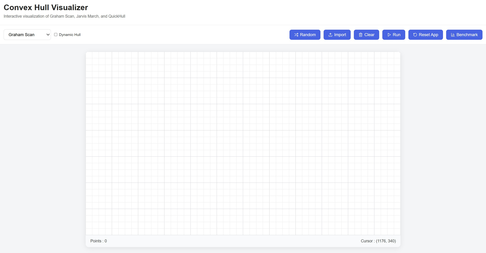

### Input Manual
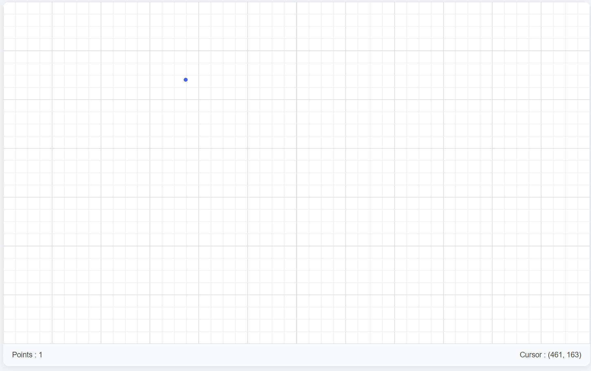

### Hasil Convex Hull
| Graham Scan | Jarvis March | QuickHull |
|---|---|---|
| 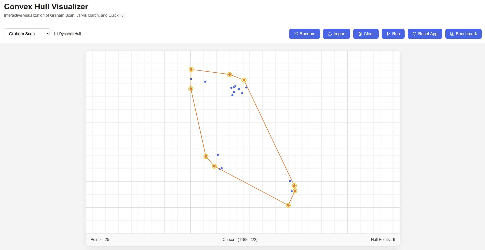 | 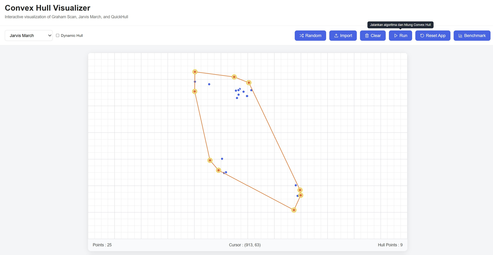 | 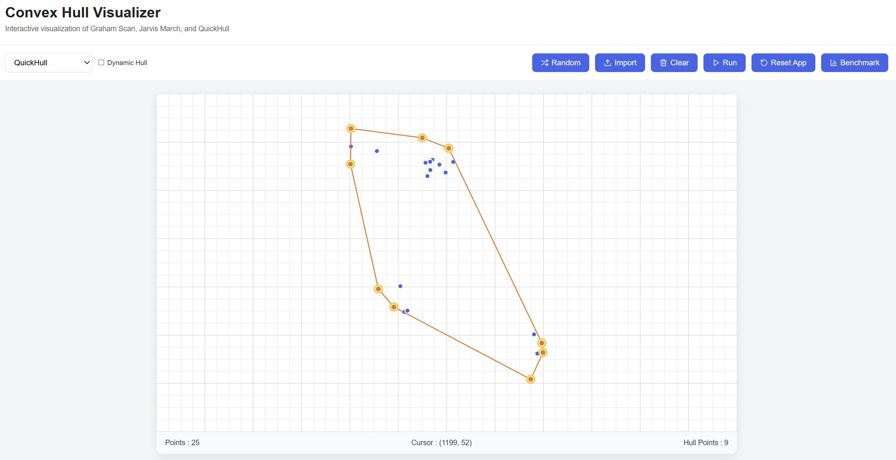 |

### Dataset Generator
| Random | Circle | Rectangle |
|---|---|---|
| 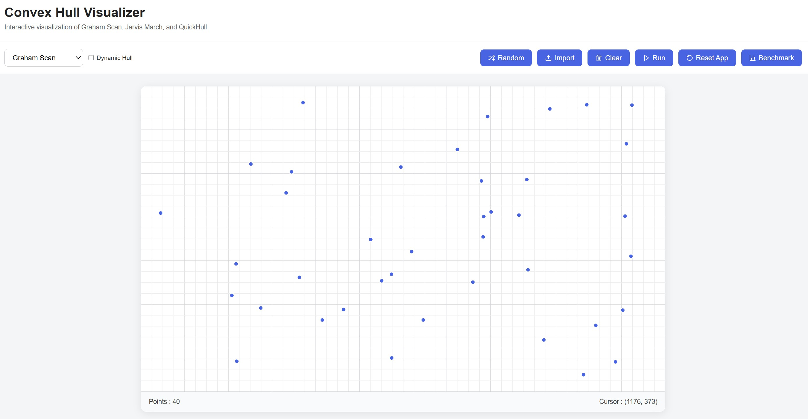 | 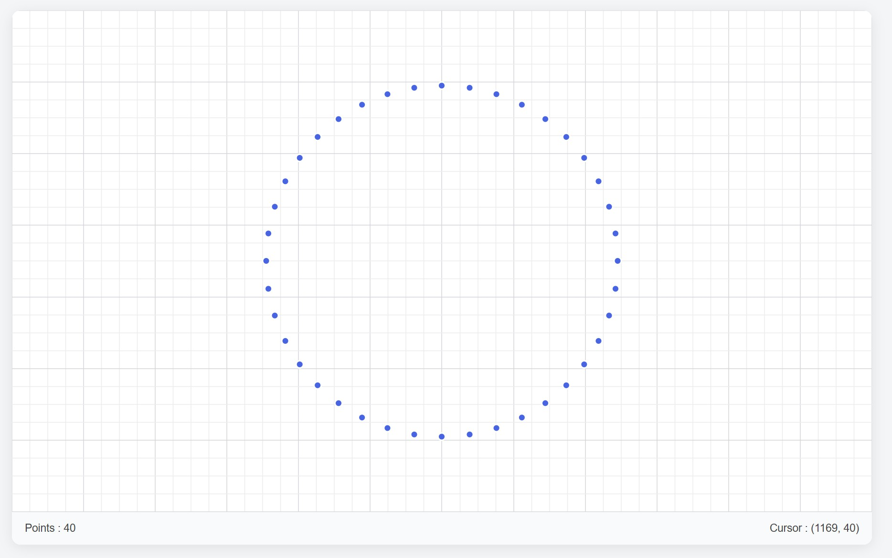 | 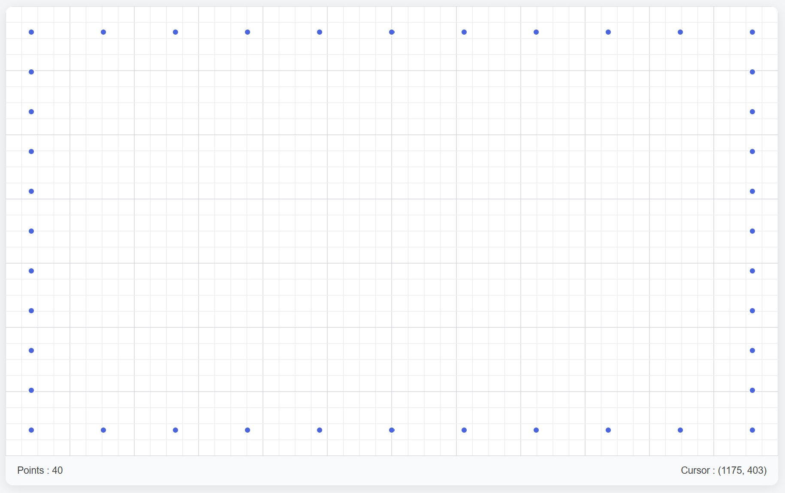 |

| Gaussian | Cluster |
|---|---|
| 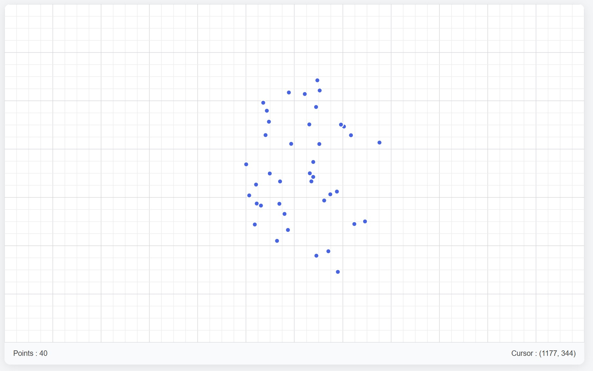 | 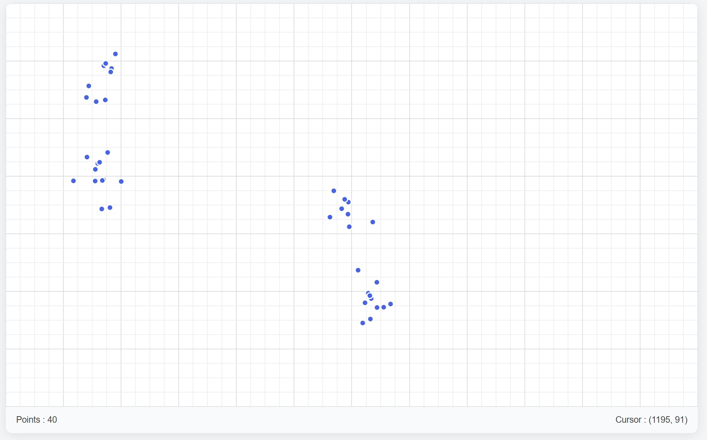 |

### Fitur Bonus
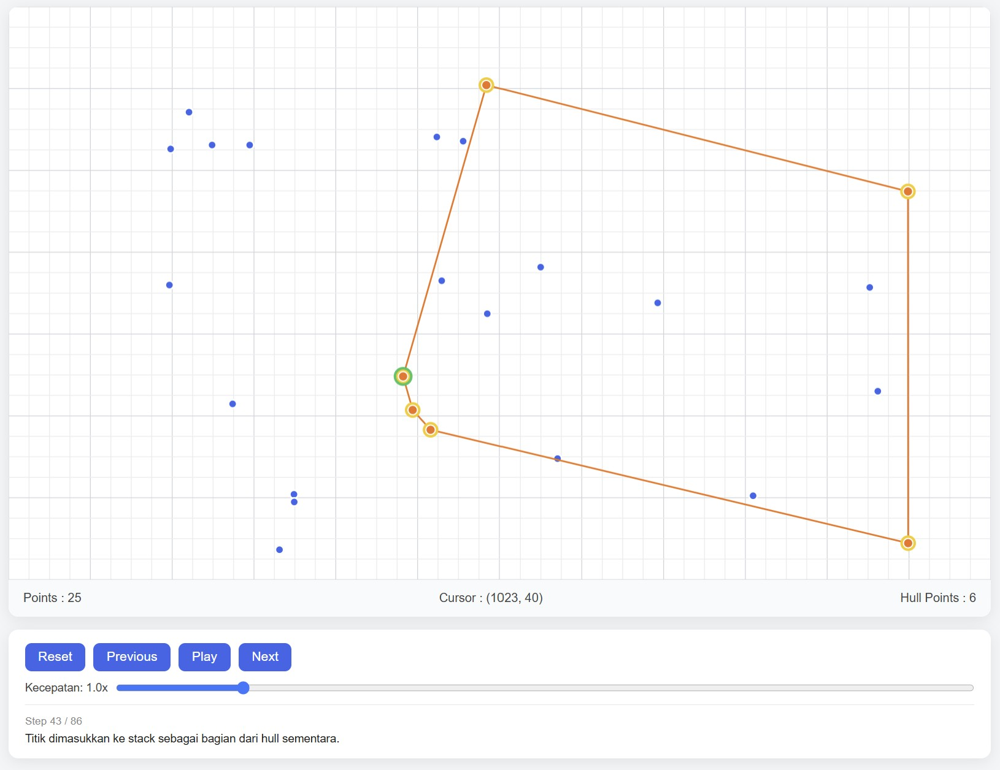
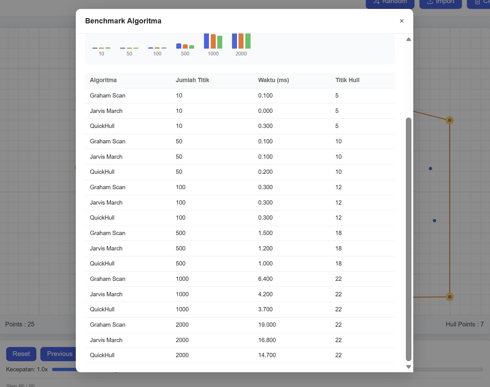
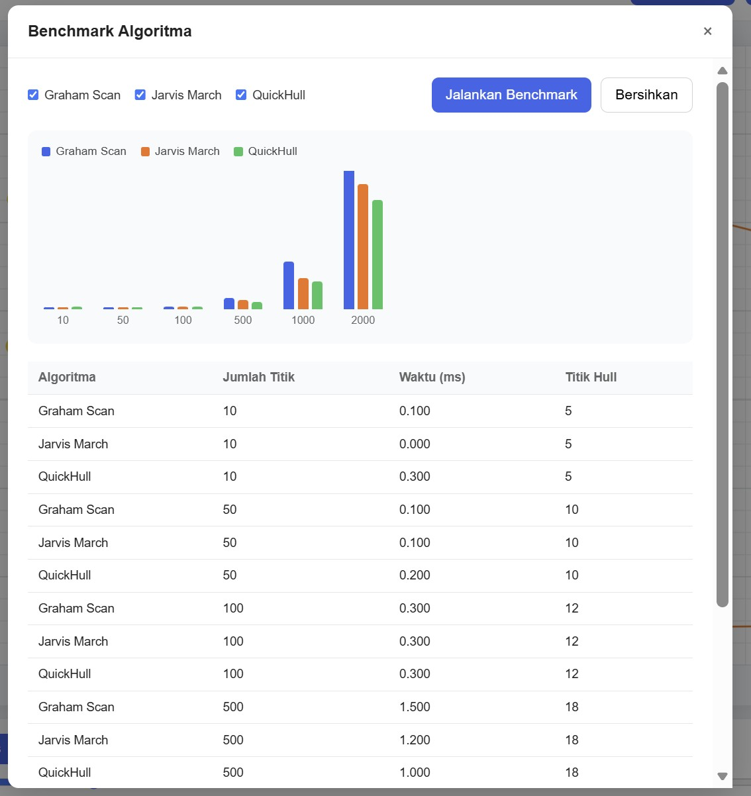
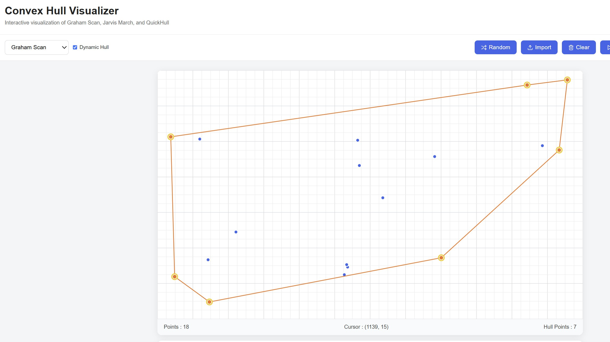


---

## Cara Menjalankan Program

### Prasyarat
- [Node.js](https://nodejs.org/) versi 20.19+ atau 22.12+ (mengikuti syarat minimum Vite 7).

### Instalasi
```bash
git clone https://github.com/kalycanbnctaa/convex-hull-visualizer
cd convex-hull-visualizer
npm install
```

### Menjalankan Mode Development
```bash
npm run dev
```
Aplikasi akan berjalan pada `http://localhost:5173` (default port Vite).

### Menjalankan Test
```bash
npm run test
```
atau mode watch:
```bash
npm run test:watch
```

### Build untuk Produksi
```bash
npm run build
npm run preview
```

### Format Import File
File `.txt` atau `.csv` yang diimpor harus berisi satu titik per baris dengan format:
```
100,200
150,80
300,220
```

---

## Referensi

- Cormen, T. H., Leiserson, C. E., Rivest, R. L., & Stein, C. (2009). *Introduction to Algorithms* (3rd ed.). MIT Press.
- GeeksforGeeks: [Convex Hull Algorithms](https://www.geeksforgeeks.org/convex-hull-algorithm/)
- Dokumentasi resmi [React](https://react.dev/), [Vite](https://vitejs.dev/), [Zustand](https://zustand-demo.pmnd.rs/), dan [Vitest](https://vitest.dev/)

---

## Video Demonstrasi

> Tautan video demonstrasi:
https://drive.google.com/file/d/1rt66hgEvxcu6RG8WkaYGmjf0nM94l-ZW/view?usp=sharing